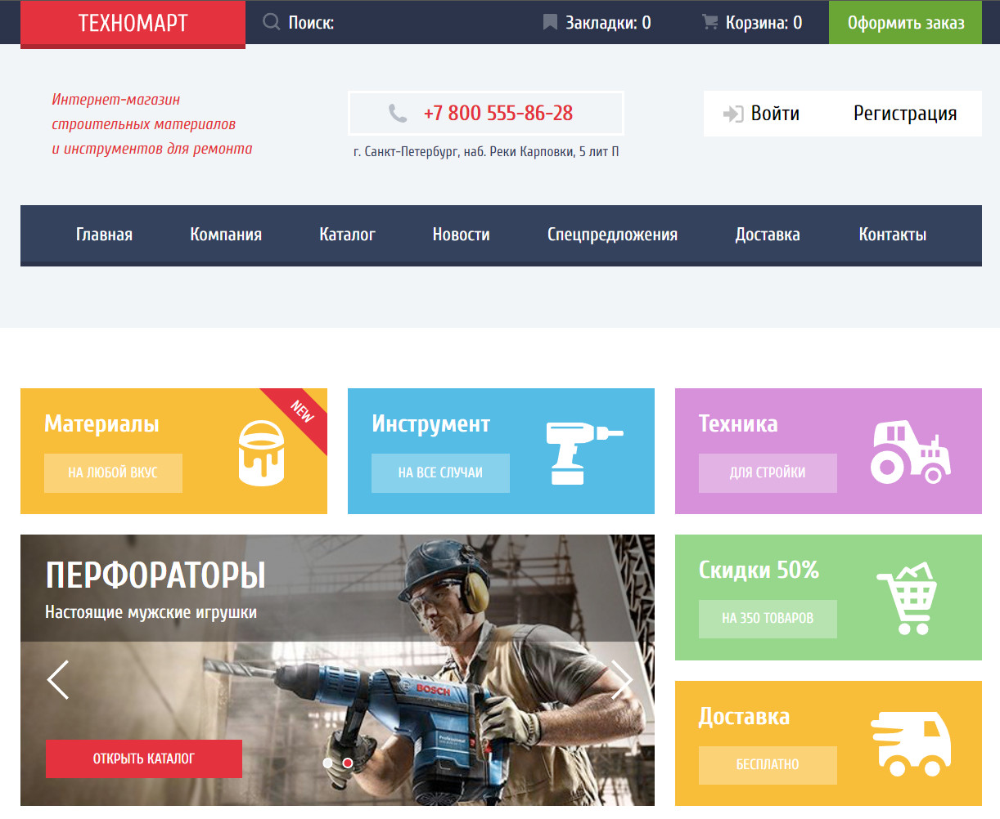

# Проект «Техномарт»
Проект по верстке от <b>HTML Academy</b> по курсу <b>"Фронтенд-разработчик"</b> <i>(средняя сложность / статика)</i>
  

### Ссылка на GH-PAGES: https://navfront.github.io/TechnoMart_htmlacademy/
 

  

## Техническое задание:

1. **Общие технические требования**  
   1.1 Стандарты вёрстки: HTML, CSS, прогрессивное улучшение.\
   1.2. Сетка: определена в макете.\
1.3. Адаптивность вёрстки: нет.\
1.4. Используемые фреймворки: нет.\
1.5. Кроссбраузерность: Chrome, Firefox, Safari.
1.6. Типографика: частично определена в макете, прочее — на усмотрение разработчика.\
1.7. Используемые шрифты: Cuprum, PT Sans. Шрифты есть в папке проекта и на Google Fonts.
1.8. С макетом предоставлен стайлгайд, содержащий прорисовку состояний элементов интерфейса. При любых расхождениях с макетами он должен иметь наивысший приоритет.   
2. **Пояснения для учащихся** \
2.1. В макетах есть модальные окна.\
2.2. В разделе «Обязательные требования» описано поведение блоков, которое должно быть реализовано для успешной защиты проекта. Требования из раздела «Дополнительные требования» можно реализовать по желанию для выполнения дополнительных критериев.   
3. **Обязательные требования** \
Все макеты:
3.1. Контентная область центрируется и не может быть уже макетной ширины. Фоны, которые упираются в края макета, должны тянуться на всю страницу.\
3.2. Если пользователь сделал закладку или добавил что-то в корзину, соответствующий пункт в шапке сайта меняет цвет фона на красный (смотрите страницу catalog).\
3.3. Авторизованному и неавторизованному посетителю показывается разный вид блока авторизации (смотрите страницы catalog и index).\
3.4. В блоке авторизованного посетителя имя и иконка пользователя являются ссылкой на профайл, а иконка выхода — на страницу деавторизации.\
3.5. Ссылка в подвале htmlacademy.ru ведёт на лендинг интенсива «HTML и CSS. Профессиональная вёрстка сайтов»\
3.6. Промо-блок («материалы», «инструмент», ...): ссылками являются только кнопки.\
3.7. Промо-блок («материалы», «инструмент», ...): слайдер. Вёрстка всех слайдов обязательна.\
3.8. Кнопка: «Открыть каталог» в слайдере — это ссылка, которая ведёт на внутреннюю страницу catalog.\
3.9. Блок «Популярные производители»: карточка производителя является ссылкой.\
3.10. Блок «Сервисы»: слайдер. Вёрстка всех слайдов обязательна.\
3.11. Блок карты: достаточная реализация — обычное изображение, клик по ней приводит к переходу на сервис карт.\
3.12. Вёрстка модального окна с формой обратной связи обязательна.
Catalog:
3.13. Логотип — это ссылка на главную страницу.\
3.14. Фильтр: верстать с помощью формы, кнопка «Показать» отвечает за отправку формы на адрес https://echo.htmlacademy.ru/.\
3.15. Блок «Цена»: при взаимодействии с любым из маркеров в качестве указателя допускается использовать любой подходящий тип курсора. Делать маркеры интерактивными не обязательно, цена меняться не должна.\
3.16. Количество товаров в правом блоке может быть любым, добавление товаров не должно ломать страницу.\
3.17. У любого товара может быть метка «new».\
3.18. Вёрстка модального окна с сообщением о добавлении в корзину обязательна.
  
4. **Дополнительные требования** \
4.1. Промо-блок («материалы», «инструмент», ...): оживление слайдера. Смена слайдов в слайдере должна происходить мгновенно, без промежуточных состояний и анимации.\
4.2. Блок «Сервисы»: оживление слайдера. Слайдер с табами работает аналогично слайдеру промо-блока: смена слайда происходит мгновенно при клике на соответствующий таб.\
4.3. Блок карты: обычное изображение. Клик по ней открывает модальное окно с полноразмерной интерактивной картой. Окно позиционируется относительно вьюпорта, а не страницы. Реализация по желанию.\
4.4. Клик по кнопке «Заблудились?..» открывает модальное окно с формой обратной связи. Окно позиционируется относительно вьюпорта, а не страницы Catalog. \
4.5. Клик по кнопке «Купить» открывает модальное окно с сообщением о добавлении товара в корзину. Окно позиционируется относительно вьюпорта, а не страницы.\
4.6. Фильтр: клик по кнопке «Показать» отправляет форму.
